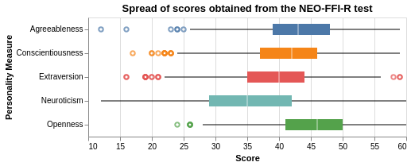
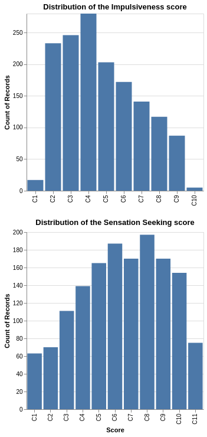
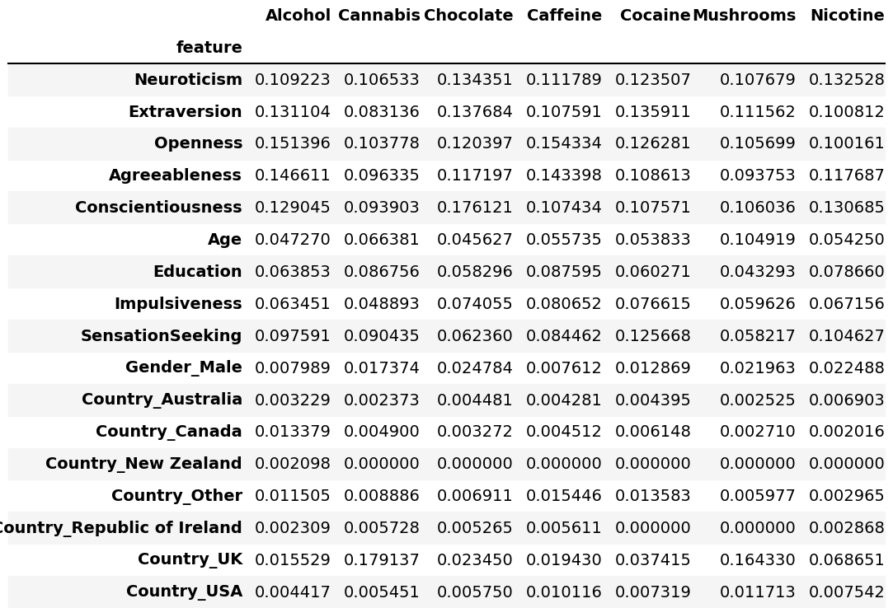

```{r setup, include=FALSE}
knitr::opts_chunk$set(echo = FALSE)
library(knitr)
library(kableExtra)
library(tidyverse)
```

# Introduction
With drug overdoses on the rise, especially in British Columbia [@general_2022], it is important that we understand what factors can influence someone into trying out drugs. Investigation of this problem could give us insight into what personality characteristics are the main motivators towards certain drugs and apply those conclusions when making public health decisions. We wanted to look at behavioural data to see if this could allow us to predict someones level of consumption of both illegal and legal drugs. 

The objective of this project is to predict if the level of consumption of different drugs given their personality traits, NEO-FFI-R (neuroticism, extraversion, openness to experience, agreeableness, and conscientiousness), BIS-11 (impulsivity), and ImpSS (sensation seeking), and personal characteristics (level of education, age, gender, country of residence, ethnicity).

This report and the setup of the repository were inspired by Tiffany Timber's Demo of a Data Analysis Project for DSCI 522 (Data Science workflows) at UBC. [@timbers]

# Methodology

## Data

The data that we used in the project is from a database that was collected by Elaine Fehrman between March 2011 and March 2012 which was sourced from  the UCI Machine Learning Repository [@drug_consumption_quantified_373]. This information was gathered through an online survey tool from Survey Gizmo was employed to gather data with maximum anonymity, this being particularly relevant to canvassing respondents' views, given the sensitive nature of drug use. All participants were required to declare themselves at least 18 years of age prior to informed consent being given. Each row of the data set is the corresponds to the individual's responses. For our analysis, we have chosen to not include Ethnicity for ethical reasons. 

## Exploratory Data Analyisis

The first step in our analysis was to explore the data that was provided. The plot below investigates the frequency of drug consumption for the drugs that we chose for our analysis.


The above plot shows the frequency of usage of different kinds of drugs. On the X-axis, we plot the frequency of drug consumption in an increasing order (Never Used to Used in the last day). It is interesting to note the trends for different drugs as we can see that:

-   For legal drugs like `Caffeine`, `Chocolate`, and `Alcohol`, More people have used it recently than many years ago.
-   For drugs like `Mushrooms`, which are legal in a few countries included in the data set and have medical uses, we see a higher number of people who have used it sometime in the last year/decade.
-   For drugs like `Cannabis` and `Nicotine`, which are often consumed together and are also legal in a few countries included in the `dataset`, have a very similar trend line.
-   For highly illegal substances, that have no medical use, like Cocaine and VSA, we see that a large proportion of the participants have either never consumed it or consumed it very long ago.

Examining the the categorical variables, we see that most of the respondents are younger, with the largest age range being 18-24.

```{r age valuecount table}
age_count <- read_csv("../results/eda/Age_valuecount.csv")
knitr::kable(age_count, caption = 'Table 1. Count of Responses by Age') |>
 kableExtra::kable_styling(full_width = FALSE)
```

In addition, the majority of respondents have some kind of post-secondary education, with the largest proportion being `Some college or university, no certificate or degree`.

```{r education valuecount table}
education_count <- read_csv("../results/eda/Education_valuecount.csv")
knitr::kable(education_count, caption = 'Table 2. Count of Responses by Education Level') |>
 kableExtra::kable_styling(full_width = FALSE)
```



The above plot shows the distribution of the NEO-FFI-R scores for all the participants involved in this experiment. We can notice that a few points are not included in the whiskers of the boxplot for some of the traits which can be explained by the small sample size. A lower score does not imply incorrect information or an outliers because it is not unusual for a person to have a very low/high score as the NEO-FFI-R test is very subjective to the person.

We can see the means of all the traits lie in the Moderate range except for the Openness trait. One reason for this could be that if a person is participating in an experiment which includes the collection of highly personal data, they are probably very open-minded people and have a high level of openness to trying new things.

Finally, looking into the ordinal columns impulsiveness and sensation seeking, we can see from plotting the histograms that the data points are clustered around the midpoint values as compared to the extreme values (high or low).



## Analysis

To build this model, we used the SVM RBF algorithm to predict whether the level of drug consumption (have never used a drug, used it a decade ago, used it in the last decade, used it in the last year, used it in the last month, used it in the last week, and used it in the last day) regarding a selection of drugs given their personality measurements. The categorical variables from the original data, were transformed using `OrdinalEncoder` if there was a natural order to the values and `OneHotEncoder` otherwise. The numerical features were scaled using `StandardScaler` since feature standardization is critical with the models used in the analysis.\
The baseline scores were found using the `DummyClassifier`. For the final model, we used `RandomizedSearchCV` with 5 folds to tune the hyperparameters $\gamma$, $C$ and class weight. Additionally, we used a `DecisionTree` to find the feature importances for each drug.

In our analysis we did encounter problems with not having enough information for each class in our test set. We consulted with a StackOverflow article which allowed us to solve the issue with our model [@stackoverflow].

For the analysis, we used Python programming language [@Python] and for the report we used the R programming language [@R] and following packages: Pandas [@mckinney-proc-scipy-2010], docopt [@docoptpython], scikit-learn [@scikit-learn], tidyverse [@tidy], [@knitr]. The code used to perform the analysis and create this report can be found here: <https://github.com/UBC-MDS/drug_consumption_prediction>.

# Results

The results of the feature importance show that NEO-FFI-R personality scores were more important to the model than features like Gender, Age, Education or Country.



The results of our model were not as promising as expected, many of the drug predictions do not perform any better than the `DummyClassifier`. The only predictions that performed better than the `DummyClassifier` were for Cannabis or Nicotine.

```{r}
test_scores <- read_csv("../results/analysis/svc_dummy_Score.csv")
knitr::kable(test_scores, caption = 'Table 4. Count of Responses by Education Level') |>
 kableExtra::kable_styling(full_width = FALSE)
```

Some limitations of this analysis is that we assumed that we did not take into account whether consumption of one drug had an impact on consumption of other drugs. In reality, these targets could have correlation. Additionally, for some drugs, we had small limited classes for certain drugs where the participants had consumed at a target level. This may have made it harder to tune our hyperparameters effectively. Ideally, we would have a larger sample with more participants at every level of consumption. In addition, many of of the respondents had a some post-secondary education, this may not accurately represent the population. Additionally, the classes were unbalanced within the target columns for each drug. Since the dataset is relatively small, it was difficult to find a strategy to cope for the imbalance. 

To improve this model, we would like to transform this problem from a classification problem to a regression problem. We believe that this could lead to better results.We could also look to try out different models to see if there are better models for this problem if we kept it a classification problem. However, based on our current results, we would not recommend for this model to be deployed at the current accuracy level. With more data and improvements to the model, the problem could be expanded to include the drug target columns that were excluded. 

# References
